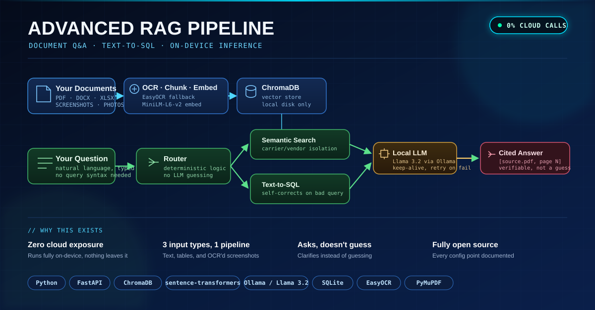

# Advanced RAG Pipeline

A retrieval-augmented generation (RAG) pipeline that lets you ask natural-language
questions about your own documents (contracts, SOPs, reports, anything text-based)
and structured data (a SQL database), with answers grounded to the exact source
document and page number.

Everything runs **entirely on your own machine**. No cloud API calls, no data
leaving your device. It uses a local embedding model, a local vector database, and
a local LLM served through [Ollama](https://ollama.com).

Works on **macOS, Windows, and Linux**. Everything here is plain Python plus
Ollama, both of which run natively on all three; there's nothing OS-specific
in the core pipeline. A few command examples below show both a Unix-style and
a Windows PowerShell version where the syntax actually differs.

Built as a working prototype for an internal logistics use case (carrier contracts
and shipment/rate data), then generalized here so anyone can point it at their own
documents. This is a learning/portfolio project, not a polished product. Read the
code; it's commented throughout with the actual bugs that were found and fixed
along the way.



## What it does

- **Document Q&A.** Chunk, embed, and index any set of documents (PDF, DOCX,
  CSV/XLSX, plain text, or a standalone image) into a vector store, then ask
  questions and get answers with citations back to the exact source file and page.
- **Automatic OCR fallback.** A PDF page is checked for a real text layer first.
  If it's a scanned or flattened image instead, it's automatically rendered and run
  through OCR (EasyOCR), with no manual flag needed. The same OCR path also handles
  a standalone screenshot or photo of a page or table (PNG/JPG/etc.) dropped in on
  its own, not just images embedded inside a PDF. Each OCR'd page or image is
  cached to disk immediately after processing, so an interrupted ingest (laptop
  sleep, closed terminal, crash) resumes from where it left off instead of
  re-paying the OCR cost for pages already done.
- **Text-to-SQL.** Ask plain-English questions against a SQL database; the LLM
  generates the query, with an automatic retry if the first attempt fails or looks
  wrong.
- **Deterministic routing.** Every question is classified in code, not left to
  the small local model's judgment, as a document question, a data question, a
  "what's in the knowledge base" question, or a general capability question.
- **Ambiguity handling.** If a question could apply to more than one ingested
  document and their answers might differ, the system asks which one you mean
  instead of guessing or blending them together.
- **Simple ingestion UI.** A lightweight web page for adding or replacing a
  document without touching the command line.

## Architecture

```
Your documents ──▶ chunk ──▶ embed ──▶ ChromaDB (vector store)
                                             │
Your question ──▶ router (code, not LLM) ──▶ ├─▶ semantic search ──▶ local LLM ──▶ cited answer
                                             └─▶ Text-to-SQL ──▶ SQLite ──▶ local LLM ──▶ answer
```

**Stack:** Python, FastAPI, ChromaDB, sentence-transformers (`all-MiniLM-L6-v2`),
Ollama (Llama 3.2 by default), SQLite, EasyOCR and PyMuPDF (OCR fallback for scanned
pages).

## Setup

### 1. Install prerequisites

- Python 3.10+ ([python.org](https://python.org), or `brew install python` on macOS)
- [Ollama](https://ollama.com) (native installers for macOS, Windows, and Linux),
  then pull a model: `ollama pull llama3.2`

### 2. Install dependencies

```bash
pip install -r requirements.txt
```

On macOS/Linux you may prefer `pip3` depending on how Python was installed.
On Windows, if `pip` isn't recognized, use `python -m pip install -r requirements.txt`.

### 3. Point it at YOUR documents

This is the main thing to customize. There's no hardcoded document folder.
You pass your own folder/file path directly on the command line:

```bash
# macOS / Linux
python rag3.py ingest "/path/to/your/documents/contract1.pdf"

# Windows (PowerShell)
python rag3.py ingest "C:\path\to\your\documents\contract1.pdf"
```

Replace the path with wherever your own files actually live on your computer.
Run this once per file (or write a loop over a folder; see `cmd_ingest` in
`rag3.py`).

Everything the pipeline generates (the vector database, the OCR cache, the
auto-generated document index) is created automatically inside `rag_data3/`
next to the script. You don't need to create that folder yourself.

### 4. (Optional) Connect a SQL table

If you have structured data (rates, shipments, orders, anything tabular) in a
SQLite database, register it in `ask_db.py` and add an entry to
`TABLE_SOURCE_LABELS` in `rag_server.py` and `TABLE_HINTS` in `ask.py`. Those
three spots are marked `>>> CUSTOMIZE HERE` in the code.

### 5. Set an admin key (optional, only needed for the upload UI)

```bash
# macOS/Linux
export RAG_ADMIN_KEY="choose-a-real-secret"
# Windows PowerShell
$env:RAG_ADMIN_KEY = "choose-a-real-secret"
```

### 6. Run the server

```bash
uvicorn rag_server:app --host 0.0.0.0 --port 8000
```

Open `http://localhost:8000` for the chat UI, or `http://localhost:8000/admin`
for the document upload page.

### Troubleshooting: corporate proxy / SSL certificate errors

If you're on a corporate network with a proxy that re-signs TLS certificates,
you may see SSL verification errors when the model or embedding files download.
Certificate verification is intentionally **on by default** here; disabling
it globally is a real security risk, not a style choice. If you've confirmed
you actually need to bypass it, set this environment variable before running
any command (do not do this on a network you don't trust):

```bash
export ALLOW_INSECURE_SSL=1   # PowerShell: $env:ALLOW_INSECURE_SSL = "1"
```

## Customization points

Search the codebase for `>>> CUSTOMIZE HERE`. Every spot that's specific to a
particular use case (table names, example vendor keywords, the system prompt's
description of who's asking and what the documents are) is marked and explained
inline. The two files most worth reading first are `rag3.py` (the retrieval, OCR,
and LLM core) and `rag_server.py` (the API layer and routing decisions).

## Known limitations

This is a prototype, and it's honest about where it's weak:

- A 3B-parameter local model is noticeably weaker than a larger hosted model at
  multi-document reasoning and at reliably following formatting/citation
  instructions. Several of the code comments describe real failure modes this
  caused and how they were mitigated.
- Retrieval uses plain vector similarity with no reranking step and no hybrid
  (keyword plus semantic) search yet. Both are natural next improvements.
- No automated accuracy evaluation is wired in yet; testing so far has been
  manual, question by question.

## License

MIT. See `LICENSE`.
